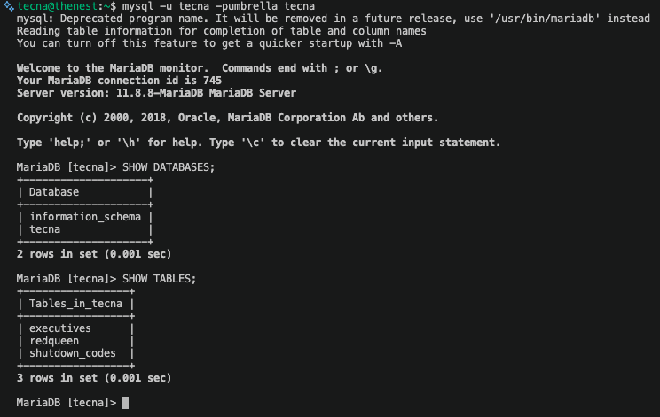
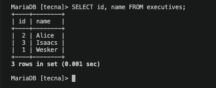
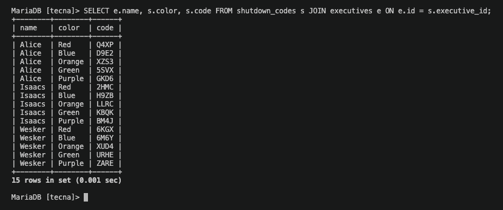

# RedQueen Override

A small PHP and MariaDB application where authorized users log in with a personal override code and can shut down or restart a simulated AI system. The status is stored in the database and persists across sessions.

### Features

Master frame layout (top, middle, bottom) shared by all pages
Login against a database using prepared statements
Persistent online/offline status stored in MariaDB
Shutdown confirmation with a randomly chosen colour code

### Stack
PHP, MariaDB, Apache (Fedora Server), HTML/CSS

Security notes: prepared statements (mysqli), hashed codes, session-based access control

## Skärmbilder

### MariaDB (databasen tecna)

### Tabellen executives (personer och hashade override-koder)

### Tabellen shutdown_codes (fem färgkoder per person)

### Inloggning

### Status: Online

### Shutdown-sidan (slumpvald färg)

### Status: Offline
